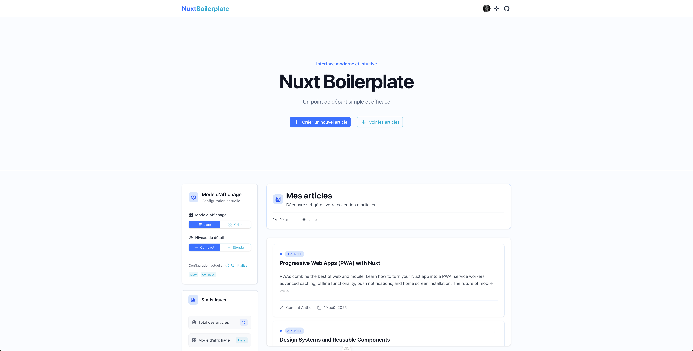

# Nuxt Boilerplate

A modern **Nuxt 4** production-ready boilerplate with TypeScript, authentication, and full-stack development tools.



## 🚀 Features

- **🔧 Nuxt 4** with Vue 3 Composition API and TypeScript
- **🎨 Nuxt UI Pro v4** components with Tailwind CSS and @iconify icons (includes Pro features for free)
- **🔐 Authentication** with nuxt-auth-utils, JWT sessions, bcrypt password hashing
- **🗄️ Prisma ORM v6** with PostgreSQL and Docker setup
- **🌍 Internationalization** (French/English) with auto-detection and SEO
- **📚 API Documentation** with OpenAPI/Swagger (development only)
- **🛡️ Security** hardening with nuxt-security (CORS, CSP, HSTS, rate limiting)
- **🧪 Testing** with Vitest (unit) and Playwright (E2E, multi-browser)
- **✨ Code Quality** with ESLint, Prettier, Husky hooks, and conventional commits
- **🗂️ State Management** with Pinia and cookie persistence
- **📱 SEO Optimized** with @nuxtjs/seo and structured meta tags
- **🐳 Docker** support with docker-compose for development

## ⚡ Quick Start

### Prerequisites

- Node.js ≥ 22.0.0
- npm ≥ 10.0.0
- Docker (for PostgreSQL)

### Setup

1. **Clone and install**

   ```bash
   git clone <repository-url> my-project
   cd my-project
   ./rename-project.sh my-awesome-project  # Optional: Rename project
   npm install
   cp .env.example .env
   ```

2. **Start database**

   ```bash
   docker compose up -d          # Start PostgreSQL
   npx prisma migrate dev        # Run database migrations
   ```

3. **Run development server**
   ```bash
   npm run dev
   ```

### 🌐 Access Points

- **Application**: http://localhost:3000
- **API Documentation**: http://localhost:3000/api/docs/ui
- **Database Admin**: http://localhost:5555 (Prisma Studio)

The app includes a complete **authentication system** and **Posts** example to demonstrate the full stack.

## 🛠️ Development Commands

### Development

```bash
npm run dev                   # Start development server
npm run build                 # Build for production
npm run preview               # Preview production build
npm run lint                  # Run ESLint + Prettier
```

### Testing

```bash
npm run test                  # Run all tests (unit + E2E)
npm run test:unit             # Run unit tests only
npm run test:e2e              # Run E2E tests only
npm run test:unit:coverage    # Run tests with coverage
```

### Database

```bash
docker compose up -d          # Start PostgreSQL + Adminer
npx prisma migrate dev        # Create and run migration
npx prisma studio             # Open Prisma Studio
npx prisma db push            # Push schema changes (dev)
```

### Deployment

```bash
npm run tag:patch             # Version bump + deploy (patch)
npm run tag:minor             # Version bump + deploy (minor)
npm run tag:major             # Version bump + deploy (major)
```

## 📁 Project Structure

```
├── app/                      # Main Nuxt application
│   ├── components/           # Vue components (auto-imported)
│   ├── composables/          # Vue composables (auto-imported)
│   ├── pages/                # File-based routing
│   └── layouts/              # Layout components
├── shared/                   # Shared utilities (auto-imported)
│   ├── models/               # TypeScript type definitions
│   ├── types/                # API and shared types
│   └── utils/                # Utility functions
├── server/                   # Server-side code
│   ├── api/                  # API routes (auto-mapped)
│   ├── middleware/           # Server middleware
│   ├── utils/                # Server utilities
│   └── services/             # Server-side services
├── lib/                      # Core libraries (Prisma, Swagger)
├── prisma/                   # Database schema and migrations
├── tests/                    # Unit and E2E tests
└── i18n/                     # Internationalization files
```

## 🔧 Tech Stack

### Frontend

- **Framework**: Nuxt 4 with Vue 3 Composition API
- **Language**: TypeScript with strict configuration
- **UI Library**: Nuxt UI with Tailwind CSS and Headless UI
- **Icons**: @iconify (Lucide and OpenMoji sets)
- **State**: Pinia with cookie persistence (@pinia-plugin-persistedstate)
- **Images**: @nuxt/image for optimization

### Backend

- **Runtime**: Nitro (Nuxt's server engine)
- **API**: H3 framework with OpenAPI/Swagger documentation
- **Database**: PostgreSQL with Prisma ORM v6
- **Authentication**: nuxt-auth-utils with JWT sessions and bcrypt
- **Validation**: Zod schema validation

### Development & Quality

- **Testing**: Vitest (unit tests) + Playwright (E2E, multi-browser)
- **Linting**: ESLint with Nuxt config + Prettier
- **Git Hooks**: Husky with conventional commits and commitlint
- **Changelog**: Conventional Changelog with automatic generation
- **Security**: nuxt-security (CORS, CSP, HSTS, rate limiting)

### DevOps & Deployment

- **Containerization**: Docker with docker-compose
- **CI/CD**: GitHub Actions ready
- **Internationalization**: @nuxtjs/i18n with French/English
- **SEO**: @nuxtjs/seo with structured data and meta tags

## 🎛️ Configuration & Customization

### Environment Setup

Copy the example environment file and configure:

```bash
cp .env.example .env
```

Key environment variables:

```bash
# Database (required)
NUXT_DATABASE_URL="postgresql://postgres:P@ssw0rd@localhost:5432/database"

# Authentication (required for JWT sessions)
NUXT_SESSION_PASSWORD="your-32-character-secret-key-here"

# SEO Configuration
NUXT_PUBLIC_SITE_URL="http://localhost:3000"  # or your production URL

# Production Security (required in production)
CORS_ORIGIN="https://yourdomain.com,https://www.yourdomain.com"
```

**Environment-specific notes:**

- **Development**: Uses `localhost` origins, relaxed CSP, includes API docs
- **Production**: Requires `CORS_ORIGIN` and `NUXT_SESSION_PASSWORD`, strict security headers

### Rename Project

```bash
./rename-project.sh my-awesome-project
```

### Authentication Features

The boilerplate includes a complete authentication system:

- **User Registration & Login** (`/auth/register`, `/auth/login`)
- **Session Management** with JWT cookies via nuxt-auth-utils
- **OAuth Support** for Google, GitHub, Discord, and other providers
- **Protected API Routes** with automatic middleware protection
- **Form Validation** with composables following consistent patterns
- **Password Security** with bcrypt hashing
- **User Context** accessible via `useUserSession()` composable

### Remove Example Code

1. Delete `shared/models/post.ts`
2. Delete `server/api/posts/` directory
3. Remove Post model from `prisma/schema.prisma`
4. Run `npx prisma migrate dev` to apply changes

### Security Configuration

The boilerplate includes production-ready security:

- **CORS**: Configurable origins per environment
- **CSP**: Content Security Policy with Nuxt-optimized directives
- **Headers**: X-Frame-Options, HSTS, X-Content-Type-Options
- **Rate Limiting**: 150 requests per 5-minute window

## 📚 Resources & Documentation

- **[Nuxt 4 Documentation](https://nuxt.com/)** - Framework documentation
- **[Nuxt UI Components](https://ui.nuxt.com/)** - UI component library
- **[Prisma Documentation](https://www.prisma.io/docs)** - Database ORM

## 🤝 Contributing

1. Follow conventional commit format
2. Run tests before submitting: `npm test`
3. Ensure code quality: `npm run lint`
4. Update documentation if needed

---

**Built with ❤️ using Nuxt 4**
